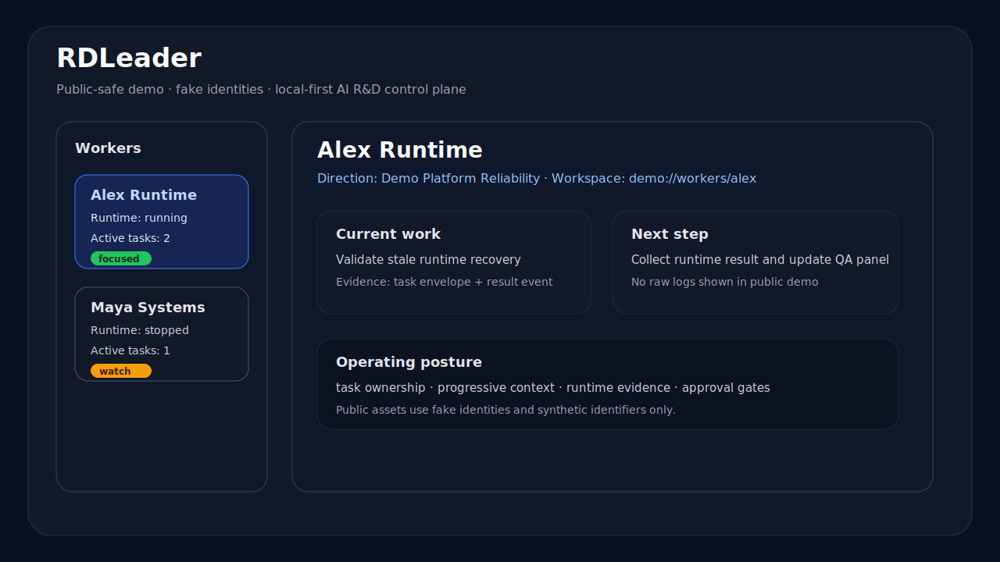
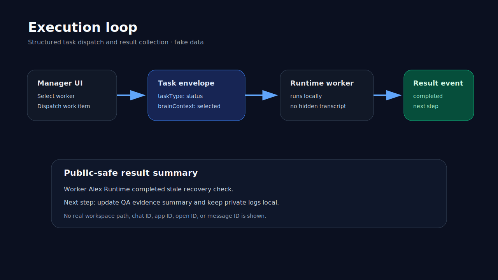
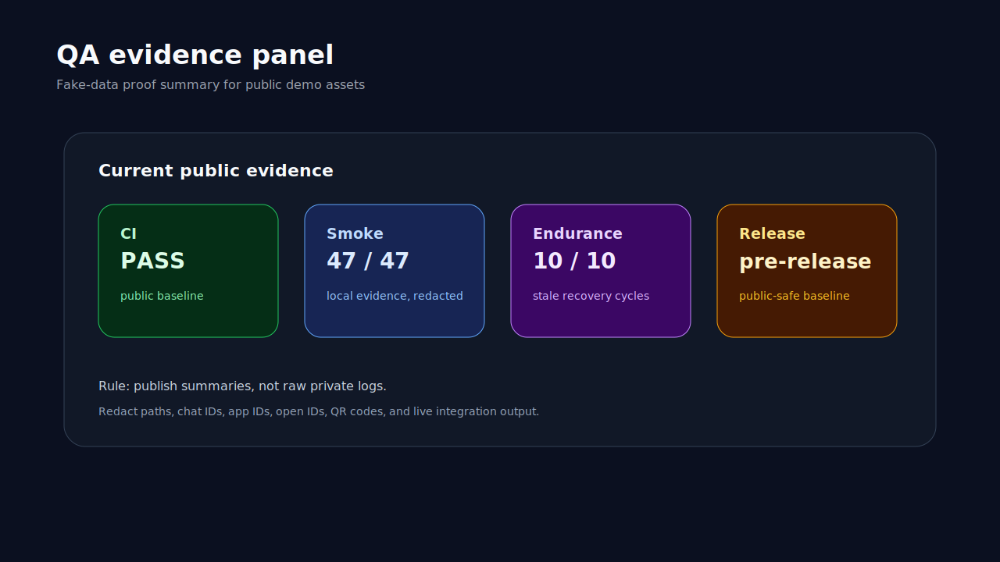

# RDLeader Public-Safe Demo Assets

These SVG assets are fake-data visuals for the public walkthrough. They are not screenshots from the local DevPlan environment.

## Assets

| Asset | Purpose |
|---|---|
| [overview demo](assets/rdleader-overview-demo.svg) | first-screen worker / manager overview |
| [execution demo](assets/rdleader-execution-demo.svg) | task envelope → runtime worker → result event loop |
| [QA demo](assets/rdleader-qa-demo.svg) | CI / smoke / endurance / release evidence panel |
| [public walkthrough video](assets/rdleader-public-walkthrough.mp4) | 40-second MP4 assembled from the fake-data demo assets |
| [narrated browser walkthrough video](assets/rdleader-browser-walkthrough-narrated.mp4) | 59-second captioned MP4 based on the browser walkthrough proof ladder |

## Preview

Video render: [rdleader-public-walkthrough.mp4](assets/rdleader-public-walkthrough.mp4)

Narrated browser video: [rdleader-browser-walkthrough-narrated.mp4](assets/rdleader-browser-walkthrough-narrated.mp4)

Technical companions: [runtime and approval deep dive](runtime-approval-deep-dive.md), [public demo reset](demo-reset.md)

## Safety notes

These assets use only synthetic values:

- `Demo Lead`
- `Alex Runtime`
- `Maya Systems`
- `Demo Platform Reliability`
- `Demo Control Plane QA`

They intentionally avoid:

- private workspace paths
- live chat identifiers
- app IDs, open IDs, or message IDs
- QR onboarding artifacts
- internal document links
- raw integration output
