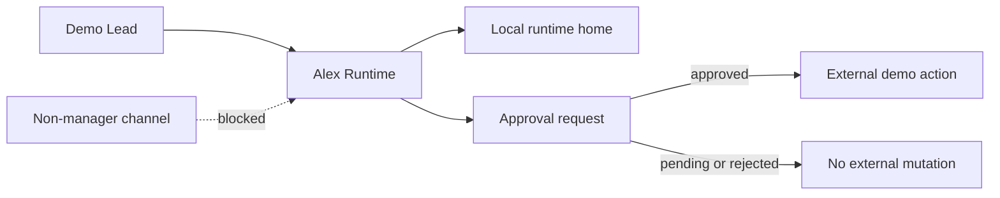

# RDLeader Employee-Agent Onboarding Guide

> Public-safe guide for adding a new RDLeader worker/agent. This document uses fake values only and is designed to explain the operating model without leaking private DevPlan identities, credentials, QR artifacts, or workspace paths.

## Onboarding promise

A new RDLeader employee-agent should have:

1. one synthetic employee record;
2. one isolated worker home;
3. one runtime home / task inbox;
4. manager-only communication by default;
5. secret references instead of inline credentials;
6. setup/status checks before any external action;
7. explicit failure modes and approval gates.

This is the boundary that makes RDLeader feel like an agent-operations control plane instead of a loose collection of chat sessions.

## Fake identity template

Use fake public values like this when preparing demos, screenshots, docs, or tests:

```json
{
  "employeeId": "alex-runtime",
  "displayName": "Alex Runtime",
  "directionId": "demo-platform-reliability",
  "managerId": "demo-lead",
  "runtimeKind": "trae_acp",
  "workspacePath": "demo://workers/alex-runtime",
  "communication": {
    "dmPolicy": "manager-only",
    "botName": "Alex Runtime Demo Bot",
    "botOpenId": "demo-bot-alex-runtime",
    "chatMode": "mention",
    "identityPreset": "bot-only"
  },
  "secretRefs": {
    "botCredential": "secret://rdleader-demo/alex-runtime/bot-token",
    "runtimeCredential": "secret://rdleader-demo/alex-runtime/runtime-token"
  }
}
```

Rules:

- `employeeId` should be stable, lowercase, and non-personal in public demos.
- `displayName` should be synthetic; do not reuse real employee names.
- `workspacePath` should use `demo://...` or another synthetic value in docs.
- `botOpenId` must be fake in public examples.
- secret values should never appear inline; only publish secret references.

## Worker home and runtime home checklist

| Step | Public-safe example | What to verify |
|---|---|---|
| Employee record | `alex-runtime` / `Alex Runtime` | ID and display name are synthetic |
| Direction | `demo-platform-reliability` | Direction does not expose an internal project name |
| Worker home | `demo://workers/alex-runtime` | No local `/Users/...` path in public docs |
| Runtime inbox | `demo://workers/alex-runtime/.rdleader/tasks/` | Task envelope path is isolated per worker |
| Runtime outbox | `demo://workers/alex-runtime/.rdleader/results/` | Result events are structured JSON summaries, not raw transcripts |
| Processed archive | `demo://workers/alex-runtime/.rdleader/results-processed/` | Collection is idempotent and inspectable |
| Manager route | `demo-lead -> alex-runtime` | Manager-only by default |
| Project room | `demo-group-control-plane` | Fake group identifier only |

## Secret-reference pattern

Publish references, never credentials:

```json
{
  "secretRefs": {
    "botCredential": "secret://rdleader-demo/alex-runtime/bot-token",
    "signingKey": "secret://rdleader-demo/alex-runtime/signing-key",
    "runtimeCredential": "secret://rdleader-demo/alex-runtime/runtime-token"
  }
}
```

Do not publish:

- real app IDs;
- app secrets;
- user or bot open IDs;
- chat IDs;
- QR onboarding images;
- OAuth callback URLs tied to a real workspace;
- copied terminal output from a live integration login.

## Setup and status checks

| Check | Pass condition | Fail-closed behavior |
|---|---|---|
| Employee profile exists | employee and profile rows exist for the same `employeeId` | do not dispatch runtime work |
| Worker home configured | synthetic or local private path is stored outside public docs | show setup-needed status |
| Runtime adapter selected | `runtimeKind` is known, e.g. `trae_acp` | mark runtime disabled or stopped |
| Task inbox writable | `.rdleader/tasks` can receive task envelopes | keep work item active and surface blocker |
| Result outbox readable | `.rdleader/results` can be collected | leave work item active until collection succeeds |
| Manager-only channel | `dmPolicy` is `manager-only` | reject or queue non-manager commands |
| External action approval | high-risk action has an approved request | return `approval_required` and do not mutate external state |
| Public-doc safety | docs checker passes | do not publish the change |

## Manager-only communication boundary

Default behavior should be conservative:



Manager-only means:

- the lead can assign or clarify work;
- worker replies can include summaries, blockers, next steps, and artifact refs;
- risky external actions become approval requests;
- project-room or external-system writes do not happen just because a worker generated a reply;
- public demos must not imply that agents are sovereign operators.

## Failure-mode table

| Failure mode | Public signal | Operator response |
|---|---|---|
| Missing employee profile | setup-needed state | create profile with fake identity template |
| Runtime task inbox unavailable | dispatch blocked | fix runtime home before retrying |
| Runtime produces no result | active or stale work item | check runtime session and stale recovery policy |
| Runtime result is `blocked` | blocked work item and work episode | clarify requirements, approve next action, or reassign |
| Runtime result is `failed` | blocked work item with failure summary | inspect sanitized summary and retry only after correction |
| External mutation requested | pending approval request | approve/reject explicitly |
| Approval rejected | no external mutation | update work item with safer next step |
| Public-doc checker fails | CI/docs gate red | redact or remove unsafe content before publishing |

## Public demo reset integration

Use the reproducible fake-data reset path when preparing screenshots or walkthroughs:

```bash
pnpm demo:reset
```

The generated demo database includes fake workers, work items, runtime dispatches, result events, approval requests, and QA evidence summaries. See [demo-reset.md](demo-reset.md) for the exact seeded surfaces and verification commands.

Companion walkthrough: [browser walkthrough over public demo state](browser-walkthrough.md).

## Public release checklist

Before publishing an onboarding update:

- [ ] identities are synthetic;
- [ ] paths are synthetic or documented only as local-private placeholders;
- [ ] credentials are secret refs, not values;
- [ ] QR artifacts are excluded;
- [ ] manager-only boundary is explicit;
- [ ] failure modes fail closed;
- [ ] `pnpm docs:check` passes;
- [ ] `pnpm test` passes when code changes are included.

## Related proof surfaces

- [Runtime and approval deep dive](runtime-approval-deep-dive.md)
- [Public demo reset](demo-reset.md)
- [Runtime endurance model](runtime-endurance.md)
- [QA evidence](qa-evidence.md)
- [Public-safe walkthrough video](walkthrough-video.md)
