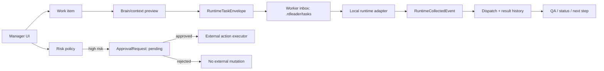

# RDLeader Runtime and Approval Deep Dive

> Public-safe technical note for RDLeader's agent-operations loop. This page uses synthetic examples only; it is not a dump of DevPlan logs or live integration output.

## What this note proves

RDLeader is framed as a control plane around AI R&D workers, not as another chat surface. The important boundary is:

1. the manager creates or selects a work item;
2. RDLeader assembles context into a typed task envelope;
3. a runtime adapter writes the task into the worker's local inbox;
4. the runtime writes back a structured result event;
5. RDLeader persists the dispatch/result history and updates operator-facing state;
6. risky external actions are converted into explicit approval requests before execution.

Implementation anchors:

- Runtime adapter contract: [`packages/runtime/src/runtime-adapter.ts`](../../packages/runtime/src/runtime-adapter.ts)
- Trae ACP adapter: [`packages/runtime/src/trae-acp-adapter.ts`](../../packages/runtime/src/trae-acp-adapter.ts)
- Context assembly: [`packages/brain/src/context-assembler.ts`](../../packages/brain/src/context-assembler.ts)
- Risk policy: [`packages/policy/src/risk-policy.ts`](../../packages/policy/src/risk-policy.ts)
- Runtime dispatch/result repositories: [`runtime-dispatch-repository.ts`](../../apps/server/src/repositories/runtime-dispatch-repository.ts), [`runtime-result-event-repository.ts`](../../apps/server/src/repositories/runtime-result-event-repository.ts)
- Approval repository: [`approval-request-repository.ts`](../../apps/server/src/repositories/approval-request-repository.ts)

## Operating loop



The loop intentionally separates **task execution** from **external mutation**. Coding/status/reflection work can be dispatched to a worker runtime, while external side effects are blocked until the lead approves them.

## Fake task envelope example

A dispatch to a worker runtime is stored as a `RuntimeTaskEnvelope`. This example uses synthetic IDs and a synthetic workspace reference.

```json
{
  "employeeId": "alex-runtime",
  "taskTitle": "Validate stale runtime recovery",
  "taskBody": "Use the demo control-plane QA scenario. Confirm stale tasks become blocked and result events are archived.",
  "taskType": "coding",
  "workItemId": "work-demo-runtime-recovery",
  "dispatchedAt": "2026-07-09T00:00:00.000Z",
  "brainContext": {
    "employeeId": "alex-runtime",
    "taskType": "coding",
    "layers": [
      { "layer": "identity", "payload": { "displayName": "Alex Runtime" } },
      { "layer": "working", "payload": ["Current focus: Demo Control Plane QA"] },
      { "layer": "knowledge", "payload": ["Runtime result events update the QA panel"] }
    ]
  }
}
```

Current implementation details:

- `POST /employees/:employeeId/runtime-dispatches` validates the employee and optional work item before dispatch.
- The server builds a brain/context preview and passes it as `brainContext`.
- `TraeAcpAdapter.sendTask` writes the envelope to the worker workspace under `.rdleader/tasks/`.
- `RuntimeDispatchRepository` persists the dispatch with `status: "dispatched"` and the workspace task reference.

## Fake runtime result example

The runtime writes structured result JSON under its result outbox. RDLeader collects it, persists the result, archives the source file, and updates operator-facing state.

```json
{
  "employeeId": "alex-runtime",
  "runtimeKind": "trae_acp",
  "dispatchId": "dispatch-demo-001",
  "workItemId": "work-demo-runtime-recovery",
  "status": "blocked",
  "summary": "Recovery check found one stale task without a result event.",
  "nextStepSummary": "Mark the work item blocked and ask the lead whether to retry or reassign.",
  "artifactRefs": ["artifact://demo/runtime-recovery-report"],
  "sourceFilePath": "demo://workers/alex/.rdleader/results/result-demo-001.json",
  "processedFilePath": "demo://workers/alex/.rdleader/results-processed/result-demo-001.json",
  "createdAt": "2026-07-09T00:05:00.000Z"
}
```

Current implementation details:

- `collectRuntimeEvents(employeeId)` reads result files from `.rdleader/results/` and moves them to `.rdleader/results-processed/`.
- Valid result statuses are `completed`, `blocked`, and `failed`.
- `RuntimeResultEventRepository` persists summary, next step, artifact refs, source path, processed path, and timestamp.
- Linked work items move to `completed` only when the runtime event is `completed`; `blocked` and `failed` both become blocked work.
- The employee's recent done / next-step summary is refreshed from the result event.
- A work episode is created so the manager can review the result without reading private runtime transcripts.

## Approval boundary model

RDLeader's public policy is deliberately simple: read/search actions are low risk, writes inside an employee workspace are medium risk, and external mutations are high risk.

| Action class | Example | Risk | Approval behavior |
|---|---|---:|---|
| Read/search | inspect docs or current worker status | low | can proceed without approval |
| Internal workspace write | write a draft task file for one worker | medium | can be queued as local worker work |
| External mutation | send a group message, update a tracker, create a shared doc, schedule a meeting | high | must produce or require approval before execution |
| Destructive/external delete | remove external state or overwrite shared records | high | should be rejected or split into a reviewed plan first |

Current implementation details:

- `requiresApproval({ kind: 'mutate-external', target: 'external-system' })` returns true.
- Risky manager chat creates a pending `ApprovalRequest` with `riskLevel: "high"`.
- External execution routes return `403` with `error: "approval_required"` unless the request explicitly carries approval.
- Approval decisions are persisted as `approved` or `rejected` with `resolvedAt`.

## Failure and recovery table

| Runtime condition | Stored event status | Work item impact | Operator next step | Evidence surface |
|---|---|---|---|---|
| Runtime completes the assigned task | `completed` | linked work item becomes `completed` | review summary and artifacts | runtime results list + work episode |
| Runtime needs human input or cannot proceed | `blocked` | linked work item becomes `blocked` | approve, retry, clarify, or reassign | result summary + blocker work episode |
| Runtime fails or returns unusable output | `failed` | linked work item becomes `blocked` | inspect sanitized summary, then retry or reassign | result event + processed result file reference |
| Runtime has no fresh result event | no event collected | work item remains active | check heartbeat/session and stale-task policy | runtime sessions + QA/endurance notes |
| Manager asks for external mutation | approval request pending | no external mutation yet | approve or reject explicitly | approval request list |

## QA evidence mapping

| Claim | Public evidence to inspect |
|---|---|
| Runtime task dispatch produces a typed envelope and dispatch history | `apps/server/src/app.test.ts` test: `dispatches a runtime task into the employee workspace inbox and persists dispatch history` |
| Runtime adapter writes task envelopes into a worker inbox | `packages/runtime/src/trae-acp-adapter.test.ts` test: `writes dispatched task envelopes into the employee workspace inbox` |
| Runtime result collection archives result files | `packages/runtime/src/trae-acp-adapter.test.ts` test: `collects runtime result events from the employee workspace and archives them` |
| Runtime result collection updates work items and result history | `apps/server/src/app.test.ts` test: `collects runtime result events, updates work item status, and persists result history` |
| Risky manager chat creates pending approval work | `apps/server/src/app.test.ts` tests for approval hints and pending approval requests |
| External mutation routes fail closed without approval | `apps/server/src/app.test.ts` tests for manager DM, group coordination, tracker writes, comments, docs, and calendar actions requiring approval |
| Public QA posture is summarized without private logs | [`docs/public/qa-evidence.md`](qa-evidence.md) and [`docs/public/runtime-endurance.md`](runtime-endurance.md) |

Local verification command for this public baseline:

```bash
pnpm test
```

## Public-safety audit

This page intentionally uses synthetic names and references:

- `Alex Runtime`, `Demo Control Plane QA`, and `work-demo-runtime-recovery` are fake values.
- `demo://...` paths are synthetic placeholders, not local machine paths.
- No app IDs, open IDs, chat IDs, message IDs, QR artifacts, internal document URLs, or raw integration output are included.
- Raw runtime transcripts remain local; public docs expose only typed contracts, summaries, and sanitized evidence surfaces.

## Next public slices

Good follow-up work:

1. add a polished architecture diagram generated from this Mermaid flow;
2. extend the [`pnpm demo:reset`](demo-reset.md) path into a fuller browser walkthrough;
3. document the final license posture in [`RDLeader#3`](https://github.com/happysnaker/RDLeader/issues/3);
4. continue the broader DevPlan sanitization checklist in [`RDLeader#1`](https://github.com/happysnaker/RDLeader/issues/1).
